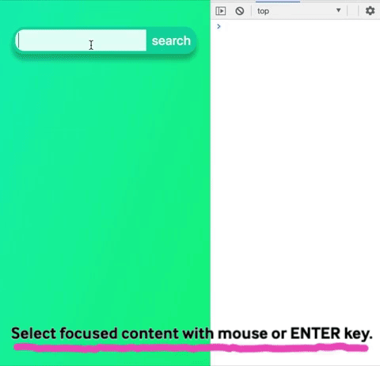

# Type-ahead Search
A search bar that suggests matching items from a json file.

## Traverse
You can traverse suggestions:


## Select
You can select suggestions to search:



## How To Use
To use this search bar for yourself, you'll want to:

1. Replace the `saved_food_data.json` file with your own .json file and replace instances of `saved_food_data.json` in the `type_ahead.html` file with your .json filename.

2. Edit line 43 to handle your data. 

  ```javascript
  // fetch your data and retrieve the PromiseValue you need
  const foods = await fetch('saved_food_data.json').then(x => x.json()).then(x => x.foods);
  ```

3. On line 59, change the list item to output the content you want. For example, `.ndbno` and `.name` are properties in *my* objects, but you will probably have different properties in *your* .json file.

  ```javascript
  // put what you want for your list items
  filtered.forEach((x) => { suggestions.innerHTML += `<li><button class = "suggestion" id="${x.ndbno}">${x.name}</button></li>`; });
  ```

4. In the `searchSuggestedFood(e)` function on line 101, add the code you need to execute your search. For example, you might do an api query that uses `selected.innerHTML` as a parameter and display the results of that query.

  ```javascript
  function searchSuggestedFood(e) {
    e.preventDefault();
    if (document.activeElement.className !== 'suggestion') return;
    const selected = document.activeElement;

    // execute some code to search `selected`

    console.log(selected.id, selected.innerHTML);
  }
  ```

  You also don't need that `console.log` statement, that's just to show that this function is being reached.

5. Change any identifiers that mention food to whatever items you're searching.

There might be more, but I think that's mostly it!
